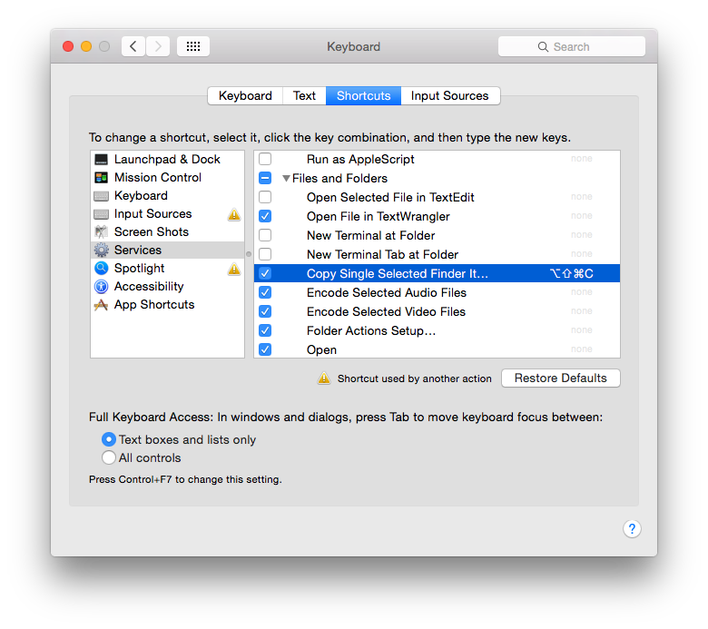

# mactools

Tools used to improve the productivity on a OSX environment.

These have been tested on 10.10 - Yosemite.

These tools include:

* [Finder Path to Clipboard](#head1234)
* [OmniFocus Effort by Selected Report] (#OmniFocusEffortBySelectedReport)
* *Outlook tools* (TODO)

# Finder Path to Clipboard

## Purpose
This is a finder service that copies a selected finder object path to the clipboard.

## Installation

1. Download the [mactools/src/install/Copy Single Selected Finder Item Path to Clipboard.zip](src/install/Copy%20Single%20Selected%20Finder%20Item%20Path%20to%20Clipboard.zip) file
2. Double click the zip file to unpack the underlying workflow file ("Copy Single Selected Finder Item Path to Clipboard") 
3. Double click on the file and choose install 
4. The installation should yield a positive result 

## Usage

1. Select a single file in the finder window
2. Right click and choose "Services > Copy Single Selected Finder Item Path to Clipboard" 
3. A dialog box indicates that the selected file path is now in your clipboard 

## Adding a keyboard shortcut

1. To go "System Preferences > Keyboard"
2. Choose "Shortcuts" and on the left side choose "Services"
3. Under "Files and Folders" find "Copy Single Selected Finder It..."
4. Click the "add shortcut" button 
5. Add your shortcut such as option + shift + command + c 

# OmniFocus Effort By Selected Report

## Purpose
This allows you to select tasks in OmniFocus and calculate the total effort hours for the selected items.

## Installation

1. Download the [mactools/src/install/Effort by Selected Report.zip](src/install/Effort%20by%20Selected%20Report.zip) file.
2. Double click the zip file to unpack the underlying workflow file ("Effort by Selected report") 
3. Double click on the file and choose install 
4. The installation should yield a positive result 

## Usage

1. In, OmniFocus, select one or more tasks.
2. Right click and choose "Services > Effort by Selected Report" 
3. A dialog box reports on the total effort for selected tasks 
